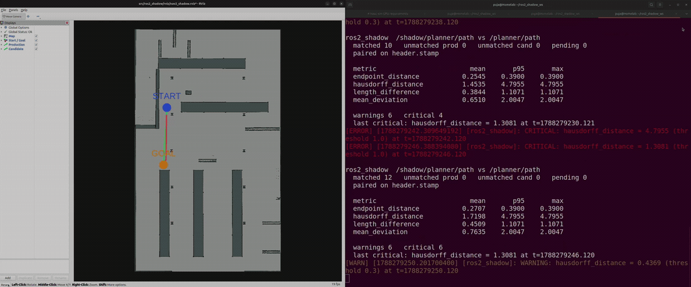

# ros2_shadow

Runs a candidate node beside a production node on the same live inputs, compares
their outputs, and reports where they disagree. Only production drives the robot.



Two real Nav2 planners on one map, given identical goals: NavFn in green as
production, Smac 2D in red as the candidate. The right pane is ros2_shadow
pairing their outputs and measuring the divergence as it happens. Full clip at
[docs/demo.mp4](docs/demo.mp4).

## Requirements

* ROS 2 Jazzy
* Python 3.10 or later

## Build

```console
$ colcon build --packages-select ros2_shadow
$ source install/setup.bash
```

The demos live in a second package so that installing the tool does not pull in
Nav2. To run them:

```console
$ colcon build --packages-select ros2_shadow_demos
```

## Usage

```console
$ ros2 run ros2_shadow shadow config.yaml
```

Unrecognised arguments are passed to rclpy, so the node namespaces and remaps
like any other. Several can run side by side:

```console
$ ros2 run ros2_shadow shadow config.yaml --ros-args -r __ns:=/robot1
```

Launch the candidate however you normally would, with its output remapped
somewhere production does not subscribe:

```console
$ ros2 run my_package my_candidate_node --ros-args -r /planner/path:=/shadow/planner/path
```

## Keeping the candidate away from hardware

Running the candidate in its own namespace is usually enough. Topic names are
resolved relative to it, so a node that publishes `cmd_vel` ends up on
`/shadow/cmd_vel` without knowing anything has changed. Nav2 relies on this for
its multi-robot configurations.

It does not cover a node that hardcodes a leading slash, or builds a topic name
at runtime. For those, the tool warns if a node under the shadow namespace
publishes on a topic listed in `safety.forbidden_topics` and suspends the
comparison, though only once the publisher appears in the graph.

If you want a guarantee rather than a warning, run the candidate in its own
`ROS_DOMAIN_ID`, where the hardware topics do not exist at all, and bridge the
inputs it needs with
[domain_bridge](https://github.com/ros2/domain_bridge). Nothing the candidate
publishes can reach production unless the bridge is configured to carry it.

Either way this covers ROS-level access only. A candidate that opens a serial
port is a container or permissions problem.

## Configuration

```yaml
production:
  topic: /planner/cmd_vel

shadow:
  topic: /shadow/planner/cmd_vel
  namespace: /shadow

comparison:
  type: geometry_msgs/msg/Twist
  synchronization:
    tolerance_ms: 20
  metrics:
    - name: linear_error
      warning: 0.05
      critical: 0.20
    - name: direction_reversal
      critical: 1.0

safety:
  forbidden_topics:
    - /cmd_vel
    - /joint_commands
    - /hardware/*
```

## Matching

The two nodes see the same inputs but finish at different times, so the newest
output from each is not a valid pair. Outputs are buffered and paired within
`tolerance_ms`.

Pairing uses `header.stamp` when the message carries one and it is populated,
and arrival time otherwise. Which clock was used is reported, because a pairing
resting on arrival time is a weaker claim than one resting on the stamp of the
input that produced both outputs. A zero stamp is treated as unpopulated.

Outputs with no partner are held for a grace period before being counted as
unmatched, so a late candidate is not recorded as a dropped one.

## Metrics

| Message type | Metrics |
| --- | --- |
| `geometry_msgs/msg/Twist` | `linear_error`, `angular_error`, `linear_x_error`, `direction_reversal` |
| `geometry_msgs/msg/PoseStamped` | `translation_error`, `rotation_error` |
| `trajectory_msgs/msg/JointTrajectory` | `joint_position_rmse`, `max_joint_delta`, `endpoint_delta`, `duration_delta` |
| `nav_msgs/msg/Path` | `hausdorff_distance`, `mean_deviation`, `endpoint_distance`, `start_distance`, `length_difference` |

`direction_reversal` reports 1.0 when the two commands drive opposite ways along
x. As a magnitude, a candidate asking for -0.3 where production asks for +0.4 is
0.7 of error and indistinguishable from drift. As a behaviour it is the robot
going the wrong way.

Joint trajectories are aligned by joint name, since two planners need not agree
on ordering.

Paths report several shapes of difference rather than one number, because a
large `hausdorff_distance` with a small `endpoint_distance` is a different route
to the same place, while the reverse is the same route stopping somewhere else.
Those are different problems. Where a comparison has no data, such as an empty
candidate path, the metric is reported as unmeasurable rather than as zero,
which would read as agreement.

## Output

```
ros2_shadow  /shadow/planner/cmd_vel vs /planner/cmd_vel
  matched 349   unmatched prod 0   unmatched cand 0   pending 0
  paired on receive_time

  metric                        mean       p95       max
  angular_error               0.0249    0.0300    0.0300
  direction_reversal          0.1146    1.0000    1.0000
  linear_error                0.1184    0.6575    0.6727

  warnings 250   critical 40
```

Divergence is also published as `diagnostic_msgs/DiagnosticArray` on
`~/divergence`, which resolves to `/ros2_shadow/divergence` by default and
follows the node into any namespace you launch it in.

The process exits non-zero if any critical divergence was seen, or if the safety
scanner suspended the run.

A sustained divergence produces one event per message. Repeats are counted and
folded into a line every two seconds rather than logged individually.

## Demo

Without a simulator, two publishers stand in for the pair:

```console
$ ros2 run ros2_shadow_demos shadow_demo_pair
$ ros2 run ros2_shadow shadow ros2_shadow_demos/config/demo_twist.yaml
```

The candidate tracks production, then drifts, then briefly commands the opposite
direction.

## Nav2 demo

Two real Nav2 planner servers on one map and one costmap configuration,
differing only in algorithm: NavFn as production, Smac 2D as the candidate. No
simulator is involved; the probe supplies start poses explicitly and drives both
servers with identical goals.

```console
$ ros2 launch ros2_shadow_demos nav2_shadow_demo.launch.py
$ ros2 run ros2_shadow shadow ros2_shadow_demos/config/nav2_shadow.yaml
$ rviz2 -d ros2_shadow_demos/rviz/nav2_shadow.rviz          # green production, red candidate
```

RViz shows both plans on the map with the start and goal each was given, so any
difference between them is the algorithm rather than the request.

```
ros2_shadow  /shadow/planner/path vs /planner/path
  matched 7   unmatched prod 5   unmatched cand 0   pending 0
  paired on header.stamp

  metric                        mean       p95       max
  endpoint_distance           0.2958    0.3900    0.3900
  hausdorff_distance          1.9171    4.7955    4.7955
  length_difference           0.5088    1.1071    1.1071
  mean_deviation              0.8425    2.0047    2.0047

  warnings 3   critical 4
```

The two planners route up to 4.8 m apart while finishing within 0.39 m of each
other: the same destination by a different route. `unmatched prod 5` is its own
result, since those are goals production answered and the candidate did not.

## Development

```console
$ python3 -m pytest ros2_shadow/test -q
```
